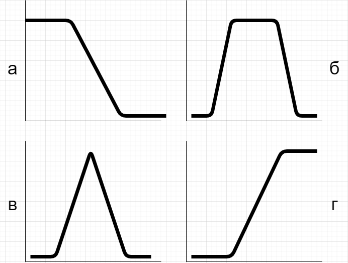

# Практическая 4. Введение в нечеткую логику

## Теоретические сведения

Математическая теория нечетких множеств и нечёткая логика является обобщением классической теории множеств и формальной логики. 

Данные понятия были предложены американским учёным З. Лотфи в 1965 году. Основной причиной появления новой теории стоило наличие нечётких и приближённых рассуждений при описании человеком процессов, систем, объектов.

Спектр приложений нечётких моделей и методов широк и от управления процессом отправления и остановки поезда метрополитена управление грузовыми лифтами и доменной печью до стиральных машин, пылесосов и печей СВЧ. 

При этом нечёткие системы позволяют повысить качество продукции при уменьшении ресурса и энергозатрат и обеспечивают более высокую устойчивость к воздействию мешающих факторов. 

Математическая теория нечетких множеств позволяет описывать нечеткие понятия и знания, оперируя этими знаниями, и делать нечеткие выводы. Нечеткая логика обеспечивает эффективные средства отображения, неопределённостей и неточностей реального мира.

#### Разработка нечеткой системы

В общем случае разработка нечеткой системы \(в дальнейшем – модели\) заключается в описании _лингвистических переменных_ системы, разработке структуры системы, выработке стратегии логического вывода, задания базы правил и, наконец, выборе наиболее приемлемого способа _дефазификации_ полученных результатов. 


Лингвистические переменные модели составляют «словарь», используемый при логическом выводе на основании заданных правил, структура системы описывает информационные потоки, связывающие отдельные элементы модели, а база правил является «мозгом» нечеткой системы, в котором сконцентрированы знания экспертов.


Таким образом, при создании нечеткой логической модели можно выделить следующие этапы:

* Этап определения лингвистических переменных моделей;
* Этап выбора функции принадлежности;
* Этап создания базы правил;
* Этап выбора способа дефазификации.

#### Определение лингвистических переменных модели

Как известно, в качестве значений лингвистических переменным могут выступать «лингвистические термы», которые обычно называют просто «термами». Термы являются возможными лингвистическими интерпретациями различных физических понятий. Так, например, понятие «расстояние», измеряемое в метрах, может иметь свою лингвистическую интерпретацию вида: «очень далеко», «далеко», «близко», «очень близко», «вплотную». Реальная физическая переменная, которую описывает лингвистическая переменная, принято называть «базовой переменной». 

Возникает вопрос: сколько необходимо задать термов для описания лингвистической переменной? 

С одной стороны, большинство концепций естественного языка предполагают наличие как минимум двух крайних значений и одного промежуточного. С другой стороны, и это определяется особенностями памяти, человек обычно не в состоянии оперировать с более чем 7 символами описания физического понятия одновременно. Все это и привело к тому, что в обычной практике для задания лингвистической переменной используют от 3 до 7 термов. Еще одной особенностью описания лингвистической переменной является то, что в большинстве случаев используется нечетное число термов \(3, 5 или 7\). Опять же этому есть свое объяснение: обычно лингвистические переменные симметричны, т.е. существует терм, который описывает среднее состояние между двумя предельными.

#### Выбор функции принадлежности

Под степенью принадлежности \(рангом\) лингвистической переменной понимают значение, которому удовлетворяет реальная физическая величина в контексте термов лингвистической переменной. Для непрерывных переменных степень принадлежности определяется с помощью так называемых функций принадлежности \(**membership function \(MBF\)**\). Функция принадлежности устанавливает соответствия между значениями реальной физической величины и термами лингвистической переменной. Обычно принято изображать все функции принадлежности для всех термов лингвистической переменной на одной диаграмме.

Несмотря на то, что в последних публикациях приводятся достаточно много различных вариантов функций принадлежности, применительно к нечеткой логике, те не менее, подавляющее большинство приложений использует стандартные функции принадлежности \(Standard-MBF\). Существует 4 типа стандартных функций принадлежности: $$Z$$-type \(а\), $$\lambda$$ -type \(lambda\)\(в\), $$\pi$$-Type \(pi\)\(б\), и $$S$$-type \(г\).



Кроме того, обычно стандартные функции принадлежности нормированы, т.е. их максимум всегда соответствует степени принадлежности $$\mu = 1 $$ , а минимум - $$\mu = 0$$.

Обычно задание стандартной функции принадлежности осуществляется в 4 приема. На первом шаге для каждого терма определяется значение, которое наиболее подходит к его лингвистическому определению. Этому значению присваивается степень принадлежности $$\mu = 1$$. На втором шаге устанавливаются границы терма, в которых степень принадлежности $$\mu = 0$$. Эти границы совпадают со значениями, наиболее типичными для соседних термов \(слева и справа\), т.е. степень принадлежности значений в данных точках для правого и левого термов равна 1. Далее, на третьем шаге, соединяем точку со значением $$\mu = 1$$ с точками, в которых $$\mu = 0$$ прямой линией. В результате получаем функцию принадлежности для термов, описывающих промежуточные значения лингвистической переменной. Граничные термы \(самый левый и самый правый\), задаются на последнем шаге. Предполагается, что все значения левее точки с $$\mu =1 $$ для самого левого терма имеют степень принадлежности тоже равную 1 \(терм Z-типа\). Аналогично, все значения правее точки с $$\mu = 1$$ для самого правого терма имеют степень принадлежности тоже равную 1 \(терм S-типа\).


Бывают ситуации, когда наиболее типичное значение терм может принимать не в одной точке, а на протяжении некоторого интервала. В этом случае терм задается с помощью функции принадлежности $$\pi$$-типа.

#### Создание базы правил

Знания нечеткой системы отражаются в виде правил логического вывода. Лингвистические переменные в данных правилах используются как словарь, на основании которого можно выработать, например, стратегию нечеткого управления для контроллера и т.д. Рассмотрим более подробно, как можно создать базу правил. 

В большинстве своем нечеткие системы используют нормализованные базы правил. При этом под нормализованной базой логических правил понимается база, в которой в предпосылках допускается использование только операции логического умножения «AND». Так, например, правило `IF A=a OR B=b THEN C=c` можно нормализовать, если разбить его на два правила:

1. `IF A=a THEN C=c`
2. `IF B=b THEN C=c`

Преимущество нормализованной базы правил очевидно: она более прозрачна для понимания. Так, например, разобраться с правилом вида:`IF ((Temp = very_high) AND NOT ((Press = above_norm) OR (Antech_Press = low)) AND (O2_Frac = NOT normal)) THEN (CH4_Val = throttled AND Carb = low)` с первого раза будет не очень просто. Несмотря на то, что для отражения точного контекста иногда может понадобиться значительно большее число нормализованных правил, чем если бы мы использовали в предусловиях весь набор стандартных логических операций, тем не менее, база даже со 100 нормализованными правилами останется понятной и легко читаемой. Кроме того, реальные нечеткие системы используют только нормализованные базы правил, так как они более эффективны с точки зрения проведения расчетов.

Для относительно небольших нечетких логических систем с несколькими входными переменными обычно придерживаются следующих шагов при формировании базы правил: На первом шаге определяется по одному правилу для каждой комбинации термов входных переменных, т.е. переменных, находящихся в части «ЕСЛИ» правила. Для этих правил устанавливается степень их поддержки \(DoS\) равная 1. Далее, для каждого заданного правила, выбирается наиболее правдоподобный терм выходной переменной \(формируется часть «ТО» правила\).

На втором шаге осуществляется проверка на полноту созданной базы правил, т.е. проверяется все ли термы выходной лингвистической переменной могут быть определены из созданной базы правил.

Далее, на третьем шаге, производится оптимизация созданной базы правил по степени важности каждого правила в отдельности. В большинстве случаев степень поддержки \(важности\) каждого правила равна 1.

И, наконец, на последнем шаге производится оптимизация базы правил путем исключения из нее ненужных правил вывода. К последним относятся правила двух видов: избыточные правила и правила, которые никогда не исполняются.

#### Выбор способа фаззификации

Результатом нечеткого логического вывода является лингвистическая переменная. Например, для антискользящей системы рулевого управления задана переменная «РУЛЕВОЕ УПРАВЛЕНИЕ», термы которой принимают значения «СИЛЬНО ВЛЕВО», «ВЛЕВО», «ПРЯМО», «ВПРАВО», «СИЛЬНО ВПРАВО». В результате расчета модели мы получили результат, который ставит в соответствие термам лингвистической переменной «РУЛЕВОЕ УПРАВЛЕНИЕ» значение функции принадлежности \(0, 0, 0.3, 0.8, 0\) соответственно, что означает приблизительно «В БОЛЬШЕЙ СТЕПЕНИ ВПРАВО ЧЕМ СЛЕГКА ВЛЕВО». Преобразование такого лингвистического значения в конкретный угол для сервомеханизма системы рулевого управления и называется дефазификацией.


 Таким образом, основная задача дефазификации - получить четкое значение, которое наилучшим образом отражало бы «нечеткое» значение выходной лингвистической переменной.


Одним из наиболее известных и широко применяемых методов поиска наиболее компромиссного решения является метод поиска центра максимума \(Center-of-Maximum method - CoM\). Согласно данному методу вначале определяются наиболее типичные значения для каждого терма, а затем вычисляется наилучшее приближение \(компромисс между всеми типичными значениями\) к результату нечеткого логического вывода. В последнем случае для получения компромиссного значения результата нечеткого логического вывода в виде вещественного числа, каждому нечеткому «подрезультату» ставится в соответствие свой вес в общем решении для позиции, соответствующей наиболее типичному значению терма. Наилучшим компромиссным решением будет «четкое» значение в точке, где все веса сбалансированы.

#### Пример описания задачи с нечетким выводом

Задача о поиске дефектной детали. Цех производит комплектующие, которые необходимо проверить на соответствие стандартам. Для этого деталь осматривают, подсчитывают ее вес, количество зубчиков, после чего необходимо отнести деталь к  одному из классов точности: Точный, Нормальный, Брак, Дефект. Необходимо составить правила нечеткого вывода для системы оценивания. 

Первым этапом является определение лингвистических термов модели. В данном случае можно отталкиваться от характеристик, которые измеряют на линии: вес, количество зубчиков. Примем нормальный вес детали за 5,3 кг. Таблица распределения лингвистических термов для характеристики "вес" предсталена ниже.

| Вес | Лингвистическая переменная  |
| :--- | :--- |
| от 1 до 4,9999 | Ниже\_нормы \(low\_norm\) |
| от 5 до 5,3 | Норма \(norm\) |
| от 5,350 до 7, 750  | Выше\_нормы \(high\_norm\) |
| от 7, 600 до 10 | Гораздо\_выше\_нормы \(hh\_norm\) |

График переменной в таком случае принимает такой вид:


Примем за нормальное количество зубчиков на детали 42. Таблица распределения лингвистических термов для характеристики "количество зубчиков" представлена ниже.

| Количество зубчиков | Лингвистическая переменная |
| :--- | :--- |
| от 10 до 41 | Ниже\_нормы \(low\_norm\) |
| 42 | Норма \(norm\) |
| от 43 до 45 | Выше\_нормы \(h\_norm\) |

График переменной в таком случае примет вид: 


Далее необходимо составить блоки правил, которые помогут системе определить нужные параметры для вывода. Для экономии времени приводится неполный перечень совокупностей правил для вывода \(В- вес, КЗ - количество зубчиков\):

```text
Если (В = Норма) И ( КЗ = Норма) 
    Тогда (Класс = Точный);
Если (В = Ниже_нормы) И (КЗ = Ниже_нормы)
    Тогда (Класс = Брак);
Если (В = Выше_нормы) И (КЗ = Норма)
    Тогда (Класс = Нормальный);
Если (В = Гораздо_выше_нормы) ИЛИ (В = Выше_нормы) 
    И (КЗ = Выше_нормы)
    Тогда (Класс = Дефект);
Если (В = Норма) И ((КЗ = Ниже_нормы) ИЛИ (КЗ = Выше_нормы))
    Тогда (Класс = Брак);
```


## Ход работы

### Задание 1. 

Составить правила нечеткого вывода для следующих задач: 

1. Задача о выборе томатов. По производственной линии транспортируют томаты, их необходимо разделить на три категории: Премиум, Обычные, Эконом. Во время транспортировки томаты взвешивают и измеряют их диаметр. Необходимо определить степень спелости томата и отнести его к одной из категорий.  
2. Задача о выпуске парашюта. Для успешного возвращения ракеты, необходим блок спасения, выпускающий парашют при совокупности событий: нужная высота, нужные координаты. Необходимо составить правила управления блоком спасения. 
3. Задача о правильном количестве специй. При приготовлении блюда важно соблюдать баланс специй для правильного ощущения вкуса. Известный повар обратился к вам с просьбой составить правила для устройства которое в зависимостимости от количества добавленных специй \(соль, сахар, перец\) сможет предсказать насколько вкусным будет блюдо. Повара используют следующую шкалу для оценивания количества специй: Чуть-чуть, Горсточка, Горсть, Много. Для оценки вкуса используется следующая шкала: Пресно, Неприятно, Сьедобно, Хорошо, Несьедобно. 

### Критерии оценки практического занятия

Оценивается знание материала, способность к его обобщению, критическому осмыслению, систематизации. 

* 3 балла: студент полностью выполнил задания.
* 2 балла: в усвоении учебного материала допущены небольшие пробелы.
* 1 балл: неполно или непоследовательно реализовано задание.
* 0 баллов: не раскрыто основное содержание учебного материала.

**Максимальный балл: 3 балла**

