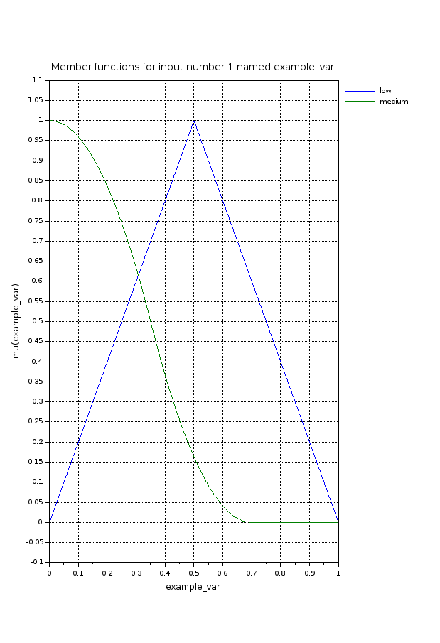

# Практическая 5. Нечеткий вывод

## Теоретические сведения

Scilab - одна из мощнейших и наиболее функциональных программ, аналог MATLAB. Представляет собой интерпретируемый язык программирования и множество математических пакетов, которые позволяют быстро получить правильное решение непростых уравнений и задач.&#x20;

Данная утилита, помимо математических вычислений, применяется в качестве среды для программирования с поддержкой соответствующих языков, среди которых C или C++. В первую очередь, это приложение разрабатывалось исключительно для решения задач по линейной алгебре, однако со временем его возможности существенно расширились..

&#x20;Разработка использует в работе те же самые алгоритмы, что и аналоги, но несмотря на это, Scilab включает в свой функционал некоторые особенные возможности. Данная программа позволяет осуществлять построение 2D и 3D графиков, создавать анимацию, решать задачи линейной алгебры, обрабатывать сигналы, решать ОДУ и ДУ. Также, программа поддерживает полиномиальные и рациональные функции, разреженные матрицы, параллельную работу, дифференциальные и недифференциальные оптимизации, интерполяцию и это еще далеко не все функции!

&#x20;Данная утилита предоставляет все необходимые инструменты для работы с платформой для визуального программирования - Lab VIEW. Показав свой вычислительный потенциал, этот программный язык превзошел все ожидания пользователей и на данный момент является одним из лучших в своем роде.&#x20;

Чтобы получить решение какой-либо задачи необходимо написать условие или задать уравнение, а система в автоматическом порядке подберет самое подходящее решение на основе введенных вами данных. Однако, пользователю предоставляется возможность создания своего модуля для решения определенной задачи, что возможно благодаря наличию графического модуля Xcos.&#x20;

При необходимости, к SciLab может быть подключен код, написанный на другом языке, например, Fortran и Java.

.png>)


### Плагины для SciLab (Scilab ATOM)

Для расширения возможностей вычислительного пакета возможна установка дополнительных модулей с различными специфическими вычислительными возможностями.&#x20;

В терминах SciLab такие программные модули называются атомы. Для их установки можно использовать как строку команд, так и графический интерфейс. Для вызова графического интерфейса используется команда `atomsGUI` или иконка на панели меню -- .&#x20;

### Атом Fuzzy Logic Toolkit

FLT - это инструментарий для SciLab по нечетким системам вывода. FLT позволяет использовать различные различные арифметические операторы, алгоритм фаззификации и дефаззификации, отношения, и различные методы приближенного рассуждения, такие как композиционное правило вывода (композициональное правило вывода (CRI) и схема приближенного аналогового рассуждения на основе меры сходства).

Для установки атомаможно исползовать команду `atomsInstall("sciFLT")  `или воспользовавшись графическим окружением для установки атомов.&#x20;

### Создание системы нечеткого вывода

Для создания системы нечеткого вывода можно использовать команды в строке команд или графический вспомогательный интерфейс. Вызвать интерфейс можно командой `sciFLTEditor()`.


Для создания системы необходимо выбрать File -> New -> Mamdani / Takagi-Sugeno. После этой команды формируются базовые атрибуты модели.

Редактор использует три основных вида ресурсов: _входные_ _переменные, выходные переменные,  базы правил_.&#x20;

**Переменные**. Каждая переменная входа/выхода разрабатываемой нечеткой логической модели связана со своим отображением - интерфейсом на рабочем листе редактора проектов (Example variable (a) на рис.2). Интерфейс переменной представляет собой небольшой прямоугольник, в котором отображаются имя переменной и иконка. В случае выходных переменных иконка отображает способ их вычисления (SoM, MoM и т.д.). При этом для входных переменных иконка расположена ближе к левому краю прямоугольника, а для выходной переменной – ближе к правому краю. Вспомогательные переменные, используемые в проекте, не связываются ни с каким интерфейсом и действуют только внутри блока правил, к которому они относятся.&#x20;

**Блок правил**. В пакете FLT правила записываются в виде текста. В левой колонке отображаются переменные, используемые в качестве условий нечетких правил (часть правила «ЕСЛИ»), а в правой колонке – переменные, получаемые в ходе применений правил логического вывода (часть правил «ТО»).&#x20;

### Создание и работа с переменными

Для создания переменной можно использовать дерево проекта (Treeview). Для добавления новой переменной можно воспользоваться кнопкой `Add `. После создания переменной редактирование осуществляется по нажатию кнопки `Edit.`


После выбора пункта создания новой переменной, открывается окно представленное на рисунке 4. В окне можно настроить параметры переменной: имя (Name), диапазон значений переменной (range). В нижней части окна расположена другая таблица предназначенная для настройки лингвистических термов для переменной и функций принадлежности. После создания новой функции принадлежности (кнопка `Add`) необходимо назвать терм, указать тип функции принадлежности и параметры функции на диапазоне переменной.&#x20;

Для того что бы определиться с типом функции принадлежности можно использовать памятку по пакету-аналогу из среды Matlab : [типы функций принадлежности](https://www.mathworks.com/help/fuzzy/foundations-of-fuzzy-logic.html).&#x20;


После настройки параметров переменной можно построить график переменной. Для этого   выделите переменную в списке переменных и нажмите следующие пункты меню `View` -> `Plot current Var`




Настроив входные и выходные переменные перейдите к созданию правил вывода в редакторе правил. Правила для вывода создаются в разделе `Rules`.&#x20;


В окне редактора необходимо выбрать термы для участвующих в правиле переменных, а также результирующую переменную. Используя операторы И, ИЛИ и НЕ определите связку правила. Для добавления правила нажмите на кнопку `Add rule`.&#x20;

На языке описания правил сконфигурированное правило можно описать так:&#x20;

```
ЕСЛИ (example_var = low) ТОГДА (output_example = 0(2)) 
```

### Проверка работы системы вывода

Для того что бы проверить работу системы вывода необходимо сохранить и загрузить систему в рабочую среду. Для сохранения используйте `File` -> `Export` -> `to flt file`.&#x20;

После сохранение системы экспортируйте ее в рабочую среду командой `fls=loadfls("ПУТЬ К ФАЙЛУ ФЛС"); . `

Для проверки работы системы вывода используется функция `evalfls([ВХОДЫЕ ЗНАЧЕНИЯ], fls);`

## &#x20;Ход работы

### Задание 1.&#x20;

Составить модель нечеткого вывода для следующих задач:&#x20;

1. Задача о выборе томатов. По производственной линии транспортируют томаты, их необходимо разделить на три категории: Премиум, Обычные, Эконом. Во время транспортировки томаты взвешивают и измеряют их диаметр. Необходимо определить степень спелости томата и отнести его к одной из категорий. &#x20;
2. Задача о выпуске парашюта. Для успешного возвращения ракеты, необходим блок спасения, выпускающий парашют при совокупности событий: нужная высота, нужные координаты. Необходимо составить правила управления блоком спасения.&#x20;
3. Задача о правильном количестве специй. При приготовлении блюда важно соблюдать баланс специй для правильного ощущения вкуса. Известный повар обратился к вам с просьбой составить правила для устройства которое в зависимостимости от количества добавленных специй (соль, сахар, перец) сможет предсказать насколько вкусным будет блюдо. Повара используют следующую шкалу для оценивания количества специй: Чуть-чуть, Горсточка, Горсть, Много. Для оценки вкуса используется следующая шкала: Пресно, Сьедобно, Хорошо, Несьедобно.&#x20;

### Критерии оценки практического занятия

Оценивается знание материала, способность к его обобщению, критическому осмыслению, систематизации.&#x20;

* 3 балла: студент полностью выполнил задания.
* 2 балла: в усвоении учебного материала допущены небольшие пробелы.
* 1 балл: неполно или непоследовательно реализовано задание.
* 0 баллов: не раскрыто основное содержание учебного материала.

**Максимальный балл: 3 балла**
