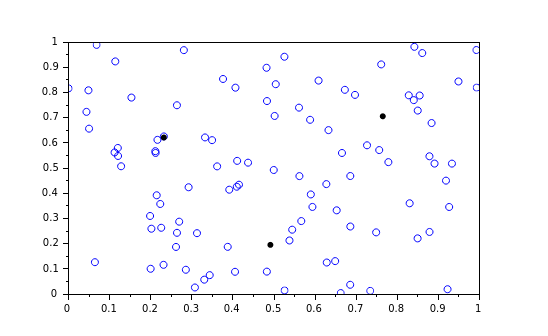

# Практическая 7. Нечеткая кластеризация

## Теоретические сведения

**Кластерный анализ** (англ. cluster analysis) — многомерная статистическая процедура, выполняющая сбор данных, содержащих информацию о выборке объектов, и затем упорядочивающая объекты в сравнительно однородные группы. Задача кластеризации относится к статистической обработке, а также к широкому классу задач обучения без учителя.

Большинство исследователей склоняются к тому, что впервые термин «кластерный анализ» (англ. cluster — гроздь, сгусток, пучок) был предложен математиком Р. Трионом. Впоследствии возник ряд терминов, которые в настоящее время принято считать синонимами термина «кластерный анализ»: автоматическая классификация, ботриология.

Методы нечеткой классификации:

* Метод нечёткой кластеризации C-средних
* Метод основ&#x20;
* Метод основанный на энтропии

### Метод нечеткой классификации С-средних

**Метод нечёткой кластеризации C-средних** (англ. fuzzy clustering, soft k-means, c-means) позволяет разбить имеющееся множество элементов мощностью $$N$$ на заданное число нечётких множеств $$k$$. Метод нечеткой кластеризации C-средних можно рассматривать как усовершенствованный метод k-средних, при котором для каждого элемента из рассматриваемого множества рассчитывается степень его принадлежности (англ. responsibility) каждому из кластеров.

**Алгоритм:**

1.  Задать случайным образом $$k$$ центров кластеров $$c_j, j = 1...k$$;

    1. Рассчитать матрицу принадлежности элементов к кластерам $$r$$ . В случае нормального распределения:&#x20;

    $$r_{ij}={\frac {{\mathcal {N}}(d(x_{i},c_{j})|\mu =0,\sigma )}{\displaystyle \sum _{j}^{k}{\mathcal {N}}(d(x_{i},c_{j})|\mu =0,\sigma )}}$$ \
    , где $$x_i$$ — $$i-й$$ элемент множества, $$с_j$$ — центр кластера $$j$$, $$d(x_{i},c_{j})$$ — расстояние между точками $$x_i$$ и $$c_j$$ , $$\mathcal {N}$$ — плотность вероятности нормального распределения в точке $$d(x_{i},c_{j})$$ .
2. Переместить центры кластеров $$c_{j}\leftarrow {\frac {\displaystyle \sum _{i}r_{ij}x_{i}}{\displaystyle \sum _{i}r_{ij}}}$$ ;
3. Рассчитать функцию потерь (например, исходя из принципа максимального правдоподобия). В случае нормального распределения функция потерь будет равна: $$J = \sum _{j}^{k}\sum _{i}^{N}d(x_{i},c_{j})^{2}r_{ij}$$ ;
4. Если значение функции потерь уменьшается, то повторить цикл с п.2.

Метод нечеткой кластеризации C-средних имеет ограниченное применение из-за существенного недостатка — невозможность корректного разбиения на кластеры, в случае когда кластеры имеют различную дисперсию по различным размерностям (осям) элементов (например, кластер имеет форму эллипса).

### Метод основанный на энтропии

Энтропия это величина определяющая меру схожести, основанная на евклидовом расстоянии.&#x20;

Чем ближе точка к центру кластера, тем меньше величина энтропии.&#x20;

**Алгоритм:**

1. Задать случайным образом $$k$$ центров кластеров $$c_j, j = 1...k$$;
2. Вычислить евклидово расстояние между $$i$$ и $$j$$ :\
   &#x20;$$d_{ij} = \sqrt{\sum_{k=1}^{L}{(x_{ik} - x_{jk})^2}}$$&#x20;
3. Вычислить меру схожести между двумя точками $$S_{ij} = e^{-\alpha d_{ij}}$$&#x20;
4. Вычислить меру энтропии для всех точек: $$E = -Slog_2S - (1 -S)log_2(1-S)$$&#x20;
5. Определяем общую меру энтропии для  $$x_i$$ относительно всех остальных данных: $$E_i = - \sum_{j \in x}^{j \neq i}{(S_{ij} log_2 S_{ij} + (1 - S_{ij} log_2 (1 - S_{ij})))}$$&#x20;

### Нечеткая кластеризация в Scilab

Реализуем алгоритм нечеткой кластеризаций используя Fuzzy Logic Toolbox для Scilab.  Реализация алгоритма нечеткого k-средних реализован в составе пакета FLT. Перед началом работы необходимо сгенерировать набор данных, которые возможно разделить на кластеры.&#x20;

```
Xin=rand(100,2);
```

Отрисуем график сгенерированных случайных пар точек.&#x20;

.png>)

Используя функцию `fcmeans` рассчитаем центры кластеров (полагаем, в наборе данных 4 кластера).&#x20;

```
[centers,U,ofun,ofunk]=fcmeans(Xin,3,2);
```

После расчета алгоритма координаты центров кластеров содержаться в переменной `centers. `Построим график центров кластеров.

.png>)

Совместим графики центров и точек из набора данных.&#x20;

```
scatter(Xin(:,1),Xin(:,2));
plot(centers(: ,1), centers(:, 2), "k.")
```



## Ход работы

#### Задание 1

Проанализируйте набор данных. Кластеризуйте его при помощи функции `fcmean`&#x20;


Набор данных для кластерного анализа


Для чтения файла csv можно использовать функцию `csvRead`&#x20;

#### Задание 2

Используя разные параметры функции кластеризации проанализируйте как меняется балансировка центров кластеров.&#x20;

### Критерии оценки практического занятия

Оценивается знание материала, способность к его обобщению, критическому осмыслению, систематизации.&#x20;

* 3 балла: студент полностью выполнил задания.
* 2 балла: в усвоении учебного материала допущены небольшие пробелы.
* 1 балл: неполно или непоследовательно реализовано задание.
* 0 баллов: не раскрыто основное содержание учебного материала.

**Максимальный балл: 3 балла**

